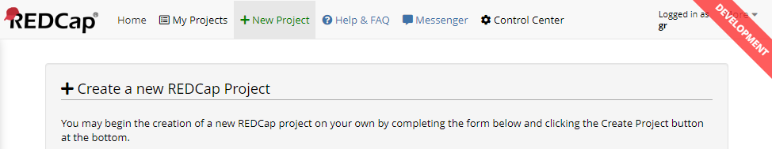

# REDCap Instance Indicator

A REDCap External Module that injects a visual clue to easily identify a REDCap instance. E.g., "Development" or "Production".

Yes, _another_ one of those modules. But I like this one better than all the others. Bam. There you have it.

## Requirements

- REDCAP 8.1 or newer.

## Installation

Automatic installation:

- Install this module from the REDCap External Module Repository and enable it.

Manual installation:

- Clone this repo into `<redcap-root>/modules/redcap_instance_indicator_v<version-number>`.
- Go to _Control Center > External Modules > Manage_ and enable 'External Module Developer Tools'.

## Configuration and Effect

Pretty self-explanatory. Open up the module's Control Center configuration, and adjust to your liking.

**Do not forget to:**
- Enable the _"Enable mmodule on all projects by default"_ option, or else you won't see anything on project pages.
- On production instances, you may want to _limit_ who get's to enjoy the visuals you so carefully created. Probably only yourself as a superusers, or power users who work on multiple REDCap instances.

This has been produced by these settings:
- Type: Develpment
- Position: Top Right
- Exclude Navbar: No, show over
- Style: Ribbon
- Opacity: 0.8
- Scale: 1

## Changelog

Version | Description
------- | --------------------
v1.0.0  | First release.
